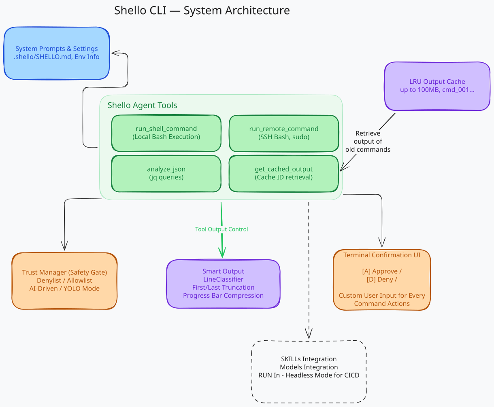

<div align="center">

# 🐚 Shello CLI

**AI-Agent for SRE & DevOps — Built for production, not playgrounds.**

[](https://github.com/om-mapari/shello-cli/releases)
[](https://github.com/om-mapari/shello-cli/actions/workflows/release.yml)
[](https://opensource.org/licenses/MIT)
[](https://www.python.org/downloads/)
[](https://github.com/om-mapari/shello-cli/releases)
[](https://github.com/om-mapari/shello-cli/stargazers)

---

### **Logs too big? Errors hidden? Shello handles it.**
Shello is a production-grade AI terminal assistant that executes commands, manages giant outputs, and extracts critical errors without blowing up your token budget.

[Explore Features](#why-shello-is-different) • [Quick Start](#quick-start) • [Report Bug](https://github.com/om-mapari/shello-cli/issues)

<br/>



</div>

## Why Shello?

| Feature | Standard AI Tools | 🐚 Shello CLI |
| :--- | :--- | :--- |
| **Giant Log Outputs (50k+ lines)** | Crash, refuse, or burn $10 in tokens | **Semantic Truncation** (keeps errors visible) |
| **Command Safety & Trust** | Blind execution without safety guardrails | **Allowlist & Denylist safety gates** with user approval |
| **Verification & Context** | Loose context / terminal memory limit | **Persistent LRU Cache** for full AI memory |
| **Massive JSON Payloads** | Dump raw text into the prompt | **JSON Intelligence** (navigates via JSON Query ([jq](https://jqlang.github.io/jq/)) paths) |
| **Model Flexibility** | Locked into one model/provider | **Runtime provider switching** (OpenAI ⇄ Bedrock) |

---

## Quick Start

### 1. Install Shello

Run the command for your operating system:

**Windows (PowerShell - No Admin needed):**
```powershell
# Create folder, download executable, and add to User PATH
New-Item -ItemType Directory -Force -Path "$env:USERPROFILE\.shello_cli" | Out-Null
Invoke-WebRequest -Uri "https://github.com/om-mapari/shello-cli/releases/latest/download/shello.exe" -OutFile "$env:USERPROFILE\.shello_cli\shello.exe"
[Environment]::SetEnvironmentVariable("PATH", $env:PATH + ";$env:USERPROFILE\.shello_cli", "User")
```

**macOS:**
```bash
curl -L https://github.com/om-mapari/shello-cli/releases/latest/download/shello-macos -o /tmp/shello && sudo mv /tmp/shello /usr/local/bin/shello && sudo chmod +x /usr/local/bin/shello
```

**Linux:**
```bash
curl -L https://github.com/om-mapari/shello-cli/releases/latest/download/shello -o /tmp/shello && sudo mv /tmp/shello /usr/local/bin/shello && sudo chmod +x /usr/local/bin/shello
```

### 2. Verify & Run

Verify that the CLI is installed correctly:
```bash
shello --version
```

Configure your API provider (first time setup):
```bash
shello setup
```

Start the interactive session:
```bash
shello
```

## See It In Action

### 1. Smart Debugging (Semantic Truncation)
When logs are too large, Shello handles it instantly without burning tokens. It strips the noise and shows you the actual failure context.

```text
🌊 user [~/k8s-cluster] 
──└─⟩ why is my pod crashing?

🐚 Shello
$ kubectl get pods
NAME                    READY   STATUS             RESTARTS   AGE
api-deployment-abc123   0/1     CrashLoopBackOff   5          3m

$ kubectl logs api-deployment-abc123
[... Truncating 2,000 lines of normal startup logs ...]
Error: ECONNREFUSED connect to database:5432
    at TCPConnectWrap.afterConnect [as oncomplete]

🔍 Root Cause Found:
Your pod cannot connect to the database on port 5432. 
Check your database service and the connection string in your deployment config.
```

### 2. Large Log Explorer (Progressive Disclosure)
When commands produce thousands of lines (e.g., builds, package installs), Shello truncates the display to keep the user's terminal clean. Behind the scenes, the full log is cached locally so the AI can query specific log segments in the background to diagnose issues.

```text
🌊 user [~/projects/myapp]
──└─⟩ npm install

🐚 Shello
$ npm install
[... Truncated 5,000 lines of npm logs. Full output cached as cmd_002 ...]

✓ Added 1,247 packages in 45s.

# If a package fails to install, the AI automatically calls:
# get_cached_output(cache_id="cmd_002", lines="-100") 
# to inspect the exact failure stack trace in the background.
```

### 3. Command Trust & Safety
Shello asks for permission before running potentially unsafe commands, keeping your environment protected.

```text
🌊 user [~/project]
──└─⟩ delete the node modules folder

🐚 Shello
┌─[💻 user@computer]─[~/project]
└─$ rm -rf node_modules

⚠️  COMMAND APPROVAL REQUIRED

  Choose an action:
  ❯ [A] Approve command
    [D] Deny command
    [C] Provide custom feedback to AI
```

## Key Features

*   🛡️ **Command Trust & Safety**
    A robust safety system checks commands before execution using a custom allowlist, denylist, and AI-driven safety flags. Skip verification entirely using YOLO mode.
*   📉 **Semantic Output Truncation**
    No more terminal floods or wasted tokens. Shello compresses progress bars, removes column padding, and ensures errors/warnings remain visible in massive log streams.
*   💾 **Progressive Disclosure Cache**
    Shello caches full terminal output locally (`cmd_001`, `cmd_002`). The AI dynamically retrieves only the relevant segments it needs to troubleshoot.
*   🧠 **JSON Intelligence**
    Analyzes giant JSON blobs by querying specific paths using JSON Query Language ([jq](https://jqlang.github.io/jq/)) instead of dumping the entire raw JSON payload to the prompt.
*   🔄 **Multi-Model & Provider Switching**
    Seamlessly switch between AI providers (OpenAI-compatible APIs, OpenRouter, AWS Bedrock) and models (Claude, Nova, GPT) dynamically during a session.
*   🐳 **Production-Ready**
    Tailored specifically for SRE & DevOps workflows debugging Cloud, Kubernetes, Docker, and Linux systems.

## Configuration

### Quick Setup

Configure your preferred AI provider (OpenAI-compatible APIs or AWS Bedrock) and default models by running the interactive setup wizard:

```bash
shello setup
```

The wizard automatically creates a global configuration file at `~/.shello_cli/user-settings.yml` with helpful inline comments.

* **Manual Tweaks**: For detailed YAML settings, custom token limits, and advanced provider configuration, see the [Development Setup Guide](DEVELOPMENT_SETUP.md#manual-configuration).
* **Credentials**: You can also set credentials via environment variables (`OPENAI_API_KEY`, `AWS_REGION`, etc.). See [Development Setup Guide](DEVELOPMENT_SETUP.md#configuration-hierarchy) for details.

## Commands

While in a chat session:
* `/new` — Start a fresh conversation.
* `/switch` — Dynamically switch between AI providers and models without losing chat history.
* `/help` — List available chat commands.
* `/quit` / `/exit` — Exit Shello.

Global CLI commands:
* `shello setup` — Run interactive configuration wizard.
* `shello config` — View current configuration settings.
* `shello config --edit` — Edit settings in your default editor.
* `shello --version` — Display version.

## Command Safety & Trust

Shello protects your system from executing dangerous commands via a built-in trust verification system:
* **Safe commands** (like `ls`, `git diff`, `grep`) execute instantly.
* **Potentially unsafe commands** trigger an interactive approval dialog prompting you to Approve, Deny, or provide Custom Feedback to the AI.
* **Highly destructive commands** (like `rm -rf /`) are blocked by a strict denylist.

To customize the allowlist/denylist patterns, configure YOLO mode, or toggle AI safety gates, see the [Command Trust and Safety Guide](DEVELOPMENT_SETUP.md#command-trust-and-safety).

## Technical Deep Dive

### Architecture Highlights

**For developers who want the details:**

- **Hybrid execution model** - Direct shell for instant commands, AI routing for analysis
- **Formal correctness properties** - 8 properties tested via property-based testing (Hypothesis)
- **Intelligent truncation** - Type detector, semantic classifier, progress bar compressor keep errors visible
- **Persistent LRU cache** - Sequential IDs (cmd_001, cmd_002...), 100MB limit, per-conversation
- **Streaming architecture** - Real-time output for you, processed summary for AI (no token waste)
- **Zero data loss** - Full output always cached, grab any section for deeper debugging
- **Modular design** - Clean separation: cache → detect → compress → truncate → analyze
- **Token optimization** - Strips column padding, compresses progress bars (2-3x fewer tokens)

## Development Setup

If you want to set up Shello CLI for local development, run tests, or build the standalone executable from source, please refer to the [Development Setup Guide](DEVELOPMENT_SETUP.md) for full instructions.

## Contributing

Contributions welcome! Fork the repo, make a feature branch, and send a PR.

Check [CONTRIBUTING.md](CONTRIBUTING.md) for guidelines.

## Links

- 🔧 [Development Setup](DEVELOPMENT_SETUP.md)
- ☁️ [AWS Bedrock Setup Guide](docs/BEDROCK_SETUP_GUIDE.md)
- 📝 [Changelog](CHANGELOG.md)
- 🐛 [Report Issues](https://github.com/om-mapari/shello-cli/issues)
- 🚀 [Latest Release](https://github.com/om-mapari/shello-cli/releases/latest)

## Author

**Om Mapari**

- GitHub: [@om-mapari](https://github.com/om-mapari)
- Project: [Shello CLI](https://github.com/om-mapari/shello-cli)

## License

MIT License - see [LICENSE](LICENSE)

## Acknowledgments

Built with:
- [Click](https://click.palletsprojects.com/) - CLI framework
- [Rich](https://rich.readthedocs.io/) - Terminal UI
- [OpenAI](https://openai.com/) - AI capabilities
- [AWS Bedrock](https://aws.amazon.com/bedrock/) - Multi-model support

---

**Made with ☕ and 🐚 by Om Mapari**
