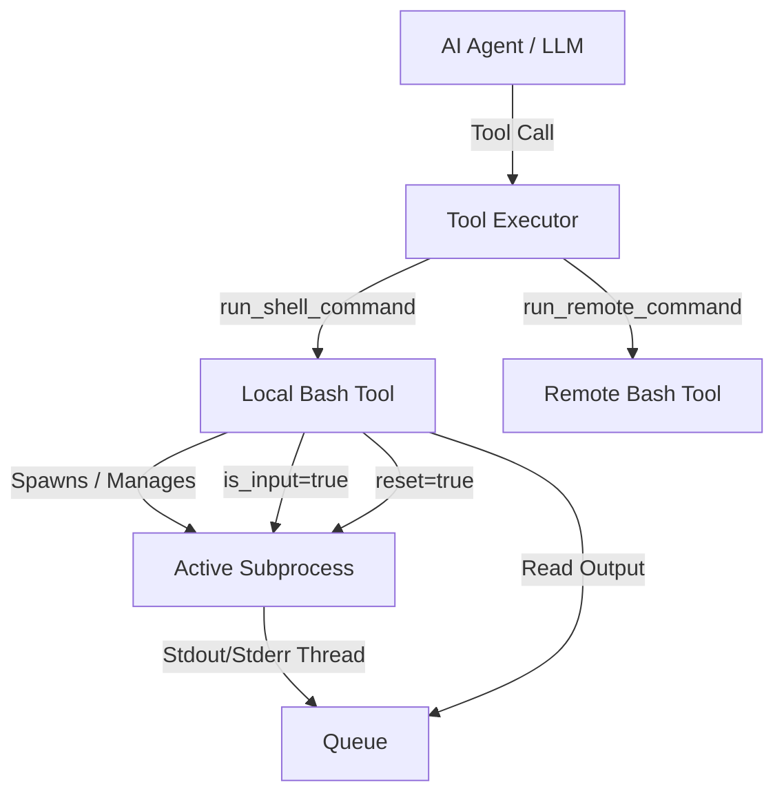

# Shell Execution & Interactive Process Control

Shello CLI features a robust, stateful execution engine for local shell commands (`run_shell_command`) and remote commands (`run_remote_command`). It implements OpenHands-style soft timeouts, background process persistence, interactive stdin injection, signal control (Ctrl+C, Ctrl+D), and contextual UI rendering.

This document describes the design, API contracts, execution flows, and UI mapping of the shell execution subsystem.

---

## Architecture Overview



The system is designed around **state persistence across LLM turns**:
1. When a command is launched, if it doesn't exit within the timeout window (default: **2 seconds**), the tool does not kill the process.
2. The process is left running in the background. Its file descriptors (stdout, stderr, stdin) are kept open.
3. The AI receives partial output and a `soft_timeout` status.
4. On subsequent turns, the AI can:
   - **Poll** the process (`command=""`) to fetch new output.
   - **Send Input** (`is_input=true`) to feed stdin or signals.
   - **Reset** (`reset=true`) to force-kill the process and clear the session.

---

## Local Execution (`run_shell_command`)

### 1. Stateful Subprocess Management
The local executor (`shello_cli/tools/bash_tool.py`) wraps a persistent Python `subprocess.Popen` instance. 

* **Output Buffering**: Background threads read stdout and stderr continuously and push lines into a thread-safe `queue.Queue`.
* **Soft Timeout (2.0s)**: If a command is still running after 2 seconds:
  - It yields whatever output was collected so far.
  - It returns `success=False`.
  - It sets `error_type="soft_timeout"`.
  - The process's exit code is returned in metadata as `-1` (indicating it is still active).

### 2. Polling (`command=""`)
If the AI calls the tool with an empty string (`command=""`):
- The tool reads any new output accumulated in the queue since the last check.
- If the process is still running, it returns after a short wait (or immediately if output is present) with `success=False` and `error_type="soft_timeout"`.
- If the process has finished, it cleans up and returns `success=True` along with the final exit code.

### 3. Interactive Input (`is_input=true`)
When a process is active and waiting for user input, the AI sends stdin using `is_input=true` and `command="<input>"`:
- The text is written directly to the subprocess's `stdin` stream followed by a newline.
- The tool then blocks for up to the soft timeout duration to read any new output generated in response to that input.

#### Signal Injection
The tool maps special commands to process-control signals:
* **Ctrl+C (`command="C-c"`)**:
  - Sends a termination signal to the active process group.
  - Cleans up and kills the subprocess.
  - Returns `success=False`, `error_type="process_control"`, and the error string `"Process interrupted (SIGINT)"`.
* **Ctrl+D (`command="C-d"`)**:
  - Closes the process's `stdin` stream (sends EOF).
  - Allows the process to continue running and read remaining output.

> [!NOTE]
> To ensure AI agents and LLMs invoke these control signals correctly, the exact magic string values `"C-c"` and `"C-d"` are documented in the `run_shell_command` tool parameter schema and the agent's system prompt instructions (under `<tool_usage_rules>`). Sending an empty string (`command=""`) with `is_input=true` does not trigger signal injection.

### 4. Session Reset (`reset=true`)
If the AI wants to terminate the active process and start a fresh terminal environment:
- The active subprocess is terminated/killed.
- All background output threads are joined.
- The internal state is fully reset.
- Returns `success=True` with `error_type="process_control"`.

---

## Remote Execution (`run_remote_command`)

Remote execution is handled via `paramiko` SSH connection caching (`shello_cli/tools/remote_bash_tool.py`).

### Key Differences from Local Execution
Because SSH channels do not easily support stateful persistent interactive shell wrappers with partial thread-based queue reads in this architecture:
1. **No Interactive Input**: `is_input=true` is **not supported** remotely. The tool will return a `process_denied` error type.
2. **No Persistent Background Process**: Commands run synchronously up to the remote connection timeout.
3. **Reset is Informational**: `reset=true` simply returns a success message stating that there is no persistent process state to reset.

---

## API Contract & ToolResult Structure

All shell tool calls return a `ToolResult` object. The UI layer uses the `error_type` field to render the status:

```python
@dataclass
class ToolResult:
    success: bool
    output: Optional[str] = None
    error: Optional[str] = None
    data: Optional[Any] = None
    error_type: Optional[str] = None  # Crucial for UI routing
```

### Map of `error_type` Values

| `error_type` | Trigger Condition | Success | UI Color / Icon | Meaning |
|---|---|---|---|---|
| *None* | Successful clean exit | `True` | Standard text | Command completed normally |
| `"soft_timeout"` | Process exceeded deadline | `False` | ⏳ Yellow | Process still alive, waiting for output or input |
| `"no_change_timeout"`| Polled but no new output | `False` | ⏳ Yellow | Process still alive, but silent |
| `"process_control"` | Ctrl+C, Ctrl+D, or Reset | `False`/`True`| ℹ Cyan | User or system sent signal or reset session |
| `"process_denied"` | Remote stdin call | `False` | ℹ Cyan | Invalid process operation (e.g. remote stdin) |
| `"fatal"` / *None* | Command crashed (exit > 0) | `False` | ✗ Red | True failure (binary not found, non-zero code) |

---

## User Interface & Rendering

Shello CLI formats shell commands inside a visual "box" using box-drawing characters:

### 1. The Header Prompt
* **Local Shell (`run_shell_command`)**:
  `┌─[💻 user@hostname]─[path]`
* **Remote Shell (`run_remote_command`)**:
  `┌─[🖥️ username@host]─[~]` (dynamically resolved from `remote_server` settings)

### 2. The Command/Signal Line
* **Standard command**: `└─$ python app.py`
* **Polling status**: `└─$ [polling active process...]`
* **Stdin injection**: `└─→ stdin: Alice`
* **Ctrl+C**: `└─⌃C [send interrupt]`
* **Session reset**: `└─↺ [reset session]`

### 3. Contextual Output / Status Messages
* **Timeout**: `⏳ Running in background — waiting for more output or user input`
* **Ctrl+C result**: `ℹ  Process interrupted (SIGINT)`
* **Failed Command**: `✗ Error: Command failed with exit code 127`
