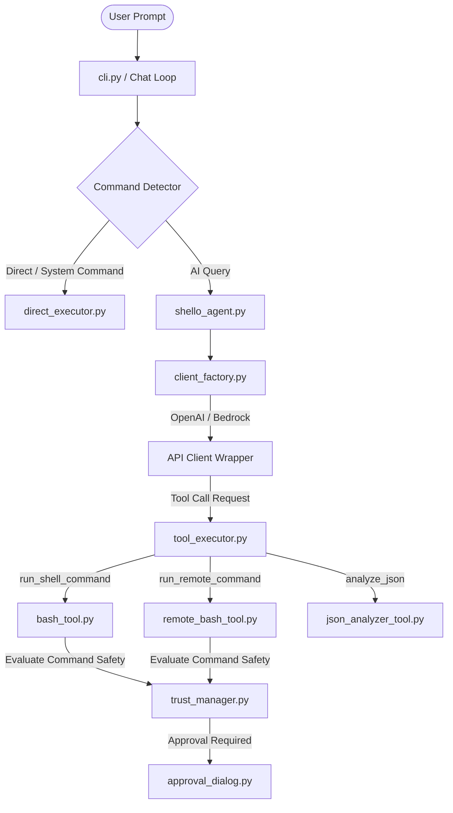

# Shello CLI - Project Structure & Architecture

## File Tree

```
shello_cli/
├── __init__.py          # Version definition
├── cli.py               # Click CLI entry point, main chat loop and command setup
├── constants.py         # App-wide templates, regexes, and system prompts
├── defaults.py          # Default fallback values for user configuration
├── patterns.py          # Command regex and safety pattern rules
├── types.py             # Shared dataclasses and type definitions (e.g. ToolResult)
│
├── agent/               # AI Orchestration Layer
│   ├── shello_agent.py  # Main agent core coordinates state and messages
│   ├── message_processor.py # Manages prompt cycles, history, and tool feedback
│   ├── tool_executor.py # Invokes bash, json, and output cache tools
│   ├── models.py        # ChatEntry and StreamingChunk schemas
│   └── template.py      # System prompt construction and instructions builder
│
├── api/                 # LLM Client Integrations
│   ├── client_factory.py    # Factory to spin up specific model provider wrappers
│   ├── openai_client.py     # Handles OpenAI-compatible endpoints
│   └── bedrock_client.py    # Handles AWS Bedrock InvokeModel API calls
│
├── chat/                # Interactive Chat Mechanics
│   └── chat_session.py  # Tracks user session history, terminal logs, and streaming
│
├── commands/            # Local & Direct Commands
│   ├── command_detector.py  # Classifies user input (Direct CLI vs AI routing)
│   ├── direct_executor.py   # Runs manual shell commands (cd, ls, git, etc.)
│   ├── context_manager.py   # Aggregates recent commands as context for prompts
│   └── settings_commands.py # Handles `shello config` and `shello setup` sub-commands
│
├── settings/            # App Configuration Systems
│   ├── manager.py       # SettingsManager singleton (handles file loading and merging)
│   ├── models.py        # Pydantic data schemas representing user configuration
│   └── serializers.py   # YAML file reading and writing templates
│
├── tools/               # Agent-Callable Capabilities
│   ├── bash_tool.py         # Stateful local execution, timeouts, Ctrl+C / Ctrl+D
│   ├── remote_bash_tool.py  # Native SSH execution via Paramiko connections
│   ├── get_cached_output_tool.py # Reads and slices stored outputs using cache IDs
│   ├── json_analyzer_tool.py     # Inspects command JSON data and generates jq paths
│   └── tools.py             # Base classes and schema registries
│
├── trust/               # Command Safety Systems
│   ├── trust_manager.py     # Command classification (safe vs destructive)
│   ├── pattern_matcher.py   # Verifies command against allowlist/denylist
│   └── approval_dialog.py   # Interactive keyboard picker for CLI confirmation
│
├── ui/                  # Console Layout & Themes
│   ├── ui_renderer.py       # Rich output styles, banners, headers, status messages
│   ├── user_input.py        # Multiline, keybindings, and history prompt setups
│   └── custom_markdown.py   # Markdown parsing and printing templates
│
└── utils/               # Helpers
    ├── output_utils.py      # Strippers, sanitizers, and compressors
    ├── settings_manager.py  # Legacy wrapper classes (deprecated)
    └── system_info.py       # OS, username, host, and shell detection (detect_shell)

tests/                   # Unit, Integration & Property Testing
├── conftest.py          # Shared mocks, settings setups, and Hypothesis profiles
└── test_*.py            # Tests targeting specific tools, configs, and APIs

docs/                    # Technical architecture guides and readmes
```

---

## Architectural Data Flow



---

## Architecture Design Patterns
- **Dependency Injection**: `ShelloAgent` receives an initialized client instance from `client_factory.create_client()`.
- **Singleton**: Configuration is accessed uniformly via `SettingsManager.get_instance()`.
- **Registry Pattern**: AI tools inherit from `ShelloToolBase` and are dynamically registered inside `tools/tools.py`.
- **Stateful Execution Wrapper**: Local commands are kept alive inside a persistent thread-safe queue subprocess to allow interactive feedback loops.

---

## Config & Settings Management
- **Hierarchy**: Project settings (`.shello/settings.yml`) always take precedence and override user settings (`~/.shello_cli/user-settings.yml`).
- **Secure Credentials**: Passwords and keys are loaded via the `keyring` library or environment variables if the local config points to storage keys.
